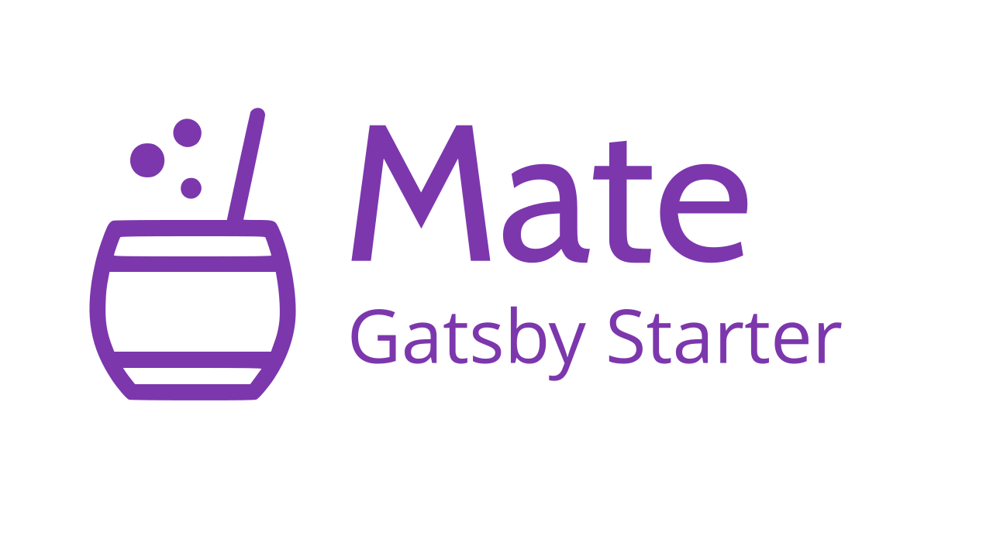

# My Awesome Portfolio

> An accessible and fast portfolio starter for Gatsby integrated with Contentful CMS.

The target audience are Developers 💻 and Tech Writers ✍️.

### [Check the Demo ✨](https://gatsby-starter-mate.netlify.com/)

## Why? 🤔

In case you are looking for a quick setup portfolio or upgrade your current, you have to definitely try Mate!

This starter is totally content based on [Contentful](https://contentful.com), which is a headless CMS where you can write the content for your page. In summary, Contentful is the Model when Gatsby with React is the View.

At the same time, as this portfolio is written with Gatsby is extremely easy to add more than one source of data! For example, the demo comes with an integration of [Medium](https://medium.com) posts based on a user name ✌️

## Features 🛠

